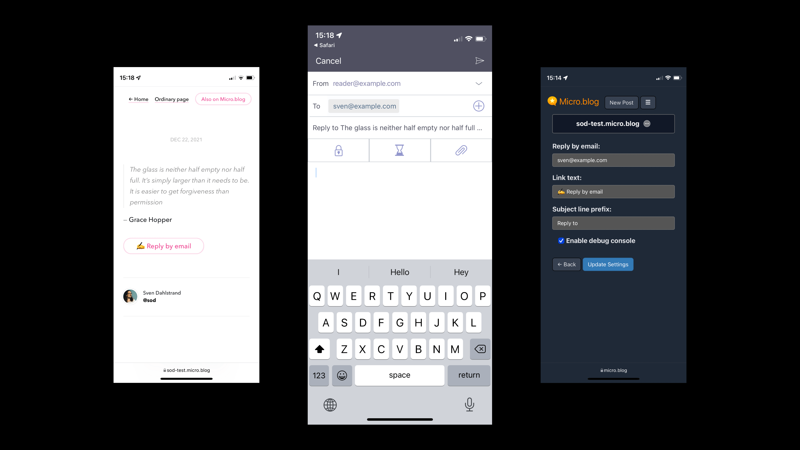

# ✍️ Reply by email for Micro.blog

Let readers reply to your blog posts using their default email app.

> Your blog posts get a **Reply by email** link with this nifty plug-in. The reader's default email app opens in compose view when they tap that link; your email address and a subject line are already filled in.

To get updates on this plug-in, [follow @sod on Micro.blog](https://micro.blog/sod).

## Bells and whistles

* 🛠 Customizable via plug-in settings.
* ✍️ Change the link text to whatever you want. Go bananas! Use emojis!
* ⛳️ Flexible placement in your theme using a Hugo partial.
* 💌 Subject line is automatically set to the blog post title (or post excerpt, if no title is present).
* 🏷 Optionally prefix the subject line with *Reply to* or whatever you want.
* 🎁 Customize the look and feel using CSS.
* 📟 Use the debug console for help with troubleshooting.

## Get started

Hello, fellow microblogger! 👋 Thanks for being here. This plug-in is available in the official directory, so the installation process is quick and easy.

### Install the plug-in

1. Find [Reply by email in the plug-in directory](https://micro.blog/account/plugins/view/23).
2. Choose the site you want to install the plug-in to.
3. Press *Install*.
4. Congratulations, the plug-in is now installed. On to configuration.

### Configure the plug-in

1. Go to *Plug-ins* and press ⚙️ *Settings* (next to the Reply by email plug-in).

2. Enter your address in *Reply by email*.

3. Make other changes as you see fit.

4. Press *Update Settings* and go to the next step.

### Include the Reply by email link in your custom theme

For this step, you need a custom theme. Maybe you already have one? If not, [follow Manton's instructions here](https://help.micro.blog/t/custom-themes/59).

1. [Follow this link](https://micro.blog/account/themes) or go to *Design* → *Edit Custom Themes*.

2. Click on your custom theme. (It's probably named Marfa Custom or something like that.)

3. Click on the template `layouts/post/single.html`

4. Add this partial call where you see fit: `{{ partial "reply-by-email.html" . }}`. A good place is after the content (look for `{{ .Content }}` in the template).

5. Press *Update Template* and pat yourself on the back.

### Make sure the Reply by email link show up

1. Find a post on your blog and make sure you see the *Reply by email* link.

2. Click it, make sure it works like expected.

### Having troubles?

Feel free to [reach out to @sod on Micro.blog](https://micro.blog/sod) for additional help.
