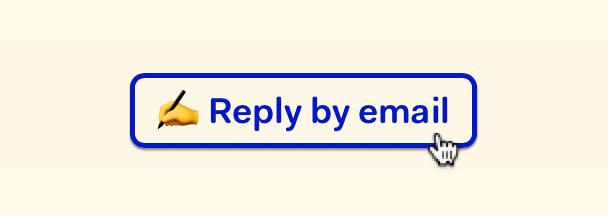

# ✍️ Reply by email for Micro.blog

Let readers reply to your blog posts using their default email app.


> Your blog posts get a **Reply by email** link with this nifty plug-in. The reader's default email app opens in compose view when they tap that link; your email address and a subject line are already filled in.

To get updates on this plug-in, [follow @sod on Micro.blog](https://micro.blog/sod).

## Bells and whistles

* 🛠 Customizable via plug-in settings.
* ✍️ Change the link text to whatever you want. Go bananas! Use emojis!
* ⛳️ Flexible placement in your theme using a Hugo partial.
* 💌 Subject line is automatically set to the blog post title (or post excerpt, if no title is present).
* 🏷 Optionally prefix the subject line with *Reply to* or whatever you want.
* 🎁 Customize the look and feel using CSS.
* 📟 Use the debug console for help with troubleshooting.

## Get started

Hello, fellow microblogger! 👋 Thanks for being here. This plug-in is available in the official directory, so the installation process is quick and easy.

### Install the plug-in

1. Find [Reply by email in the plug-in directory](https://micro.blog/account/plugins/view/23).
2. Choose the site you want to install the plug-in to.
3. Press *Install*.
4. Congratulations, the plug-in is now installed. On to configuration.

### Configure the plug-in

1. Go to *Plug-ins* and press ⚙️ *Settings* (next to the Reply by email plug-in).

2. Enter your address in *Reply by email*.

3. Make other changes as you see fit.

4. Press *Update Settings* and go to the next step.

### Include the Reply by email link in your custom theme

For this step, you need a custom theme. Maybe you already have one? If not, [follow Manton's instructions here](https://help.micro.blog/t/custom-themes/59).

1. [Follow this link](https://micro.blog/account/themes) or go to *Design* → *Edit Custom Themes*.

2. Click on your custom theme. (It's probably named Marfa Custom or something like that.)

3. Click on the template `layouts/post/single.html`

4. Add this partial call where you see fit: `{{ partial "reply-by-email.html" . }}`. A good place is after the content (look for `{{ .Content }}` in the template).

5. Press *Update Template* and pat yourself on the back.

### Make sure the Reply by email link show up

1. Find a post on your blog and make sure you see the *Reply by email* link.

2. Click it, make sure it works like expected.

### Customize the look and feel

The *Reply by email* link is delivered to you with minimal markup and styles. Every Micro.blog theme is individual, and this bare-bones approach keeps it flexible. It's up to you to implement a custom look and feel using HTML and CSS. Here's a couple of examples for your inspiration.

#### Give the link breathing room with a paragraph

There's an easy way to add a space between the *Reply by email* link and content around it. Just wrap the link in a paragraph. Add the partial call to the template in this way:

```html
<p>{{ partial "reply-by-email.html" . }}</p>
```

That should result in the same amount of breathing space text paragraphs have between them.

#### Flexible look and hover effect using CSS

If you're comfortable with CSS, there are endless possibilities for styling. And if you're new to CSS, you can still do it! You can learn a lot from [@Miraz's](http://micro.blog/miraz) excellent tutorials. Start with [What you need to know about CSS to customise your Micro.Blog blog](https://custom.micro.blog/2019/06/04/what-you-need.html).

The *Reply by email* link is just an `a` element with the class `reply-by-email`. I experimented with the CSS below to get a nice hover effect. It's not guaranteed to look good on your blog, though. 😉



To add custom CSS to a Micro.blog, navigate to *Design* → *Edit CSS*.

```css
.reply-by-email {
  border: solid 0.15rem black;
  border-radius: 0.4rem;
  color: black;
  display: inline-block;
  font-weight: bold;
  padding: 0.3rem 0.6rem 0 0.6rem;
  text-decoration: none;
}

.reply-by-email:hover {
  border-color: #011ac5;
  box-shadow: 0 1px 1px rgba(0, 0, 0, 0.5);
  color: #011ac5;
  text-decoration: none;
}
```

### Having troubles?

Feel free to [reach out to @sod on Micro.blog](https://micro.blog/sod) for additional help.
